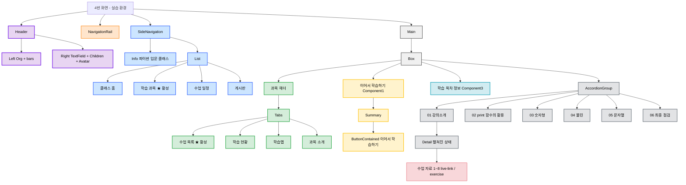
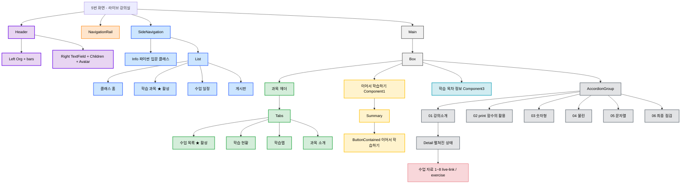

# UI Audit 통합 분석 — 5개 화면

> **분석 대상:** 1번 ~ 5번 화면 (학습 과목 목록 → 수업 목록 → 학습 현황 → 실습 환경 → 라이브 강의실)

---

## 화면 목록

| # | 화면명 | 파일명 | 주요 콘텐츠 |
|---|--------|--------|-------------|
| 1 | 학습 과목 목록 | `1번 화면 - 학습 과목 목록` | 과목 카드 리스트, 진도 바 |
| 2 | 수업 목록 | `2번 화면 - 학습 과목` | 탭 (수업목록), 아코디언 수업 목차 |
| 3 | 학습 현황 | `3번 화면 - 학습 현황` | 탭 (학습현황), 학습 현황 요약, 막대 그래프, 데이터 테이블 |
| 4 | 실습 환경 | `4번 화면 - 실습 환경` | 모달스크린, 아코디언 수업 목차 |
| 5 | 라이브 강의실 | `5번 화면 - 라이브 강의실` | 모달스크린, 참여자리스트 Pagination |

---

## 공통 레이아웃 구조

전체 5개 화면은 동일한 3단 레이아웃을 공유합니다.

| 영역 | 컴포넌트 | 너비 | 설명 |
|------|----------|------|------|
| 상단 | `Header` | 100% | 로고, 검색, 알림, 아바타 |
| 좌측 1단 | `Navigation Rail` | 72px | 전역 네비게이션 (아이콘 + 라벨) |
| 좌측 2단 | `Side Navigation` | 260px | 클래스 내 메뉴 (4개 항목) |
| 중앙 | `Main` | 유동 (최대 1024px) | 화면별 본문 콘텐츠 |

---

## 1번 화면 — 학습 과목 목록

### 1-1. UI 요소 목록

| 구분 | UI 요소 | 요소 이름 | 비고 |
|------|---------|-----------|------|
| **Header** | Logo | `Elice Logo` | 브랜드 로고, 보라색(#6700E6) |
| Header | Chip | `Enterprise` | 기관 유형 표시 칩 |
| Header | Dropdown Button | `LXP` | 서비스 선택 드롭다운 |
| Header | Menu Icon | `Icon Button (bars)` | 햄버거 메뉴 아이콘 |
| Header | Search Field | `TextField` | 검색 입력 필드 (220px) |
| Header | Notification Icon | `Icon Button (bell)` | 알림 아이콘 버튼 |
| Header | Message Icon | `Children 내부 버튼` | 아이콘: `message-lines` |
| Header | Avatar | `원형 도형` | 32×32 회색 원, Ellipse 311 |
| **Navigation Rail** | Nav Item | `기관 홈` | home 아이콘 |
| Navigation Rail | Nav Item | `탐색` | compass 아이콘 |
| Navigation Rail | Nav Item | `내 클래스` | book-open-cover 아이콘 |
| Navigation Rail | Nav Item | `대시보드` | table-columns 아이콘 |
| Navigation Rail | Nav Item | `더 보기` | ellipsis 아이콘 |
| **Side Navigation** | Title | `파이썬 입문 클래스` | ExtraBold, 20px |
| Side Navigation | Menu Item | `클래스 홈` | chalkboard-user 아이콘 |
| Side Navigation | Menu Item | `학습 과목` | list 아이콘 |
| Side Navigation | Menu Item | `수업 일정` | calendar 아이콘 |
| Side Navigation | Menu Item | `게시판` | chalkboard 아이콘 |
| **Main — 헤더** | Section Header | `학습 과목 목록 헤더` | 페이지 타이틀 |
| **Main — 카드** | 과목 카드 | `과목 카드` | 썸네일 + 텍스트 + 액션 |
| 과목 카드 | Thumbnail | `Image` | 160×90 placeholder |
| 과목 카드 | 과목명 | `Text` | 도레미 파이썬 1/2, 파이썬 기초 문제집 |
| 과목 카드 | 메타 정보 | `Text` | 파이썬 • 입문 • 8-16시간 |
| 과목 카드 | 진도 바 | `Linear Progress/Determinate` | 25% 표시 |
| 과목 카드 | 진도 세그먼트 | `01 / 02 / 03 / 04` | 01만 채워짐 |
| 과목 카드 | CTA 버튼 | `Button/Contained` | 이어서 학습하기 |
| 과목 카드 | 더보기 버튼 | `Icon Button` | ellipsis-vertical 아이콘 |
| **Main — 구분선** | Divider | `Divider` | 카드 간 separator |

### 1-2. 컴포넌트 단위 목록

| 영역 | 컴포넌트 | 실제 data-name | 구성 요소 |
|------|----------|----------------|-----------|
| **Screen** | 메인 레이아웃 | `1번 화면 - 학습 과목 목록` | Header + Main |
| **Header** | Header | `Header` | Left + Right |
| Header | Left | `Left` | 햄버거 버튼 + 로고 + 조직 선택 |
| Header | Org | `Org` | 텍스트 + Chip/Filled + chevron-down |
| Header | Search | `TextField` | search icon + 입력 텍스트 |
| Header | Actions | `Children` | 알림 버튼 + 메시지 버튼 |
| **Main** | Main Layout | `Main` | Navigation Rail + Side Navigation + Container |
| Navigation | Navigation Rail | `Navigation Rail` | ListItem × 5 |
| Navigation | Rail Item | `ListItem` | Icon + Label |
| Navigation | Side Navigation | `Side Navigation` | Info + List |
| Navigation | Side Nav / Info | `Info` | 클래스명 텍스트 |
| Navigation | Side Nav / List | `List` | ListItem × 4 |
| **Content** | Content Wrapper | `Box` | 페이지 헤더 + 카드 목록 |
| Content | 페이지 헤더 | `학습 과목 목록 헤더` | 타이틀 텍스트 |
| Content | 과목 카드 | `과목 카드` | Image + Text + Progress + Button + Icon Button |
| Content | Thumbnail | `Image` | 썸네일 |
| Content | 과목명 + 메타 | `Text` | 과목명 + 메타 정보 |
| Content | 진도 바 | `Linear Progress/Determinate` | ProgressContainer + Typography |
| Content | ProgressContainer | `ProgressContainer` | 단계 요소 (01, 02, 03, 04) |
| Content | CTA | `Button/Contained` | 이어서 학습하기 버튼 |
| Content | More | `Icon Button` | 더보기 버튼 |
| Content | Divider | `Divider` | 구분선 |

### 1-3. 컴포넌트 구조 시각화

```mermaid
graph TD
    A["1번 화면 - 학습 과목 목록"]

    A --> B["Header"]
    A --> C["Main"]

    B --> B1["Left"]
    B --> B2["Right"]
    B1 --> B11["Icon Button bars"]
    B1 --> B12["Elice Logo"]
    B1 --> B13["Org"]
    B13 --> B131["LXP"]
    B13 --> B132["Enterprise"]
    B13 --> B133["chevron-down"]
    B2 --> B21["TextField 검색"]
    B2 --> B22["Children"]
    B2 --> B23["Avatar"]
    B22 --> B221["bell"]
    B22 --> B222["message-lines"]

    C --> C1["Navigation Rail"]
    C --> C2["Side Navigation"]
    C --> C3["Content"]

    C1 --> C11["기관 홈"]
    C1 --> C12["탐색"]
    C1 --> C13["내 클래스"]
    C1 --> C14["대시보드"]
    C1 --> C15["더 보기"]

    C2 --> C21["Info 파이썬 입문 클래스"]
    C2 --> C22["Menu"]
    C22 --> C221["클래스 홈"]
    C22 --> C222["학습 과목"]
    C22 --> C223["수업 일정"]
    C22 --> C224["게시판"]

    C3 --> C31["학습 과목 목록 헤더"]
    C3 --> C32["과목 리스트"]
    C32 --> D1["과목 카드 1"]
    C32 --> D2["Divider"]
    C32 --> D3["과목 카드 2"]
    C32 --> D4["Divider"]
    C32 --> D5["과목 카드 3"]

    D1 --> D11["Image 썸네일"]
    D1 --> D12["Text 과목명 + 메타"]
    D1 --> D13["Linear Progress 25%"]
    D1 --> D14["Button/Contained 이어서 학습하기"]
    D1 --> D15["Icon Button ellipsis-vertical"]
    D13 --> D131["ProgressContainer 01~04"]

    D3 --> D31["Image"]
    D3 --> D32["Text"]
    D3 --> D33["Icon Button"]
    D5 --> D51["Image"]
    D5 --> D52["Text"]
    D5 --> D53["Icon Button"]

    classDef header fill:#E3F2FD,stroke:#64B5F6,color:#000
    classDef nav fill:#E8F5E9,stroke:#81C784,color:#000
    classDef content fill:#FFF3E0,stroke:#FFB74D,color:#000
    classDef main fill:#F3E5F5,stroke:#BA68C8,color:#000

    class B,B1,B2,B11,B12,B13,B131,B132,B133,B21,B22,B23,B221,B222 header
    class C1,C2,C11,C12,C13,C14,C15,C21,C22,C221,C222,C223,C224 nav
    class C3,C31,C32,D1,D2,D3,D4,D5,D11,D12,D13,D14,D15,D131,D31,D32,D33,D51,D52,D53 content
    class C main
```

---

## 2번 화면 — 수업 목록

### 2-1. UI 요소 목록

| 구분 | UI 요소 | 요소 이름 | 비고 |
|------|---------|-----------|------|
| **Header** | Logo | `Elice Logo` | 브랜드 로고, 보라색(#6700E6) |
| Header | Chip | `Enterprise` | 기관 유형 표시 칩 |
| Header | Dropdown Button | `LXP` | 서비스 선택 드롭다운 |
| Header | Menu Icon | `Icon Button (bars)` | 햄버거 메뉴 아이콘 |
| Header | Search Field | `TextField` | 검색 입력 필드 (220px) |
| Header | Notification Icon | `Icon Button (bell)` | 알림 아이콘 버튼 |
| Header | Message Icon | `Icon Button (message-lines)` | 메시지 아이콘 버튼 |
| Header | Avatar | `Circle Avatar` | 사용자 프로필 아바타 (회색) |
| **Navigation Rail** | Nav Item | `기관 홈` | home 아이콘, 64px 너비 |
| Navigation Rail | Nav Item | `탐색` | compass 아이콘, 64px 너비 |
| Navigation Rail | Nav Item | `내 클래스` | book-open-cover 아이콘, 64px 너비 |
| Navigation Rail | Nav Item | `대시보드` | table-columns 아이콘, 64px 너비 |
| Navigation Rail | Nav Item | `더 보기` | ellipsis 아이콘, 64px 너비 |
| **Side Navigation** | Title | `파이썬 입문 클래스` | 클래스 제목 (ExtraBold, 20px) |
| Side Navigation | Menu Item | `클래스 홈` | chalkboard-user 아이콘 |
| Side Navigation | Menu Item | `학습 과목` | list 아이콘, 현재 활성화 상태 (회색 배경) |
| Side Navigation | Menu Item | `수업 일정` | calendar 아이콘 |
| Side Navigation | Menu Item | `게시판` | chalkboard 아이콘 |
| **Main — 과목 헤더** | Back Button | `과목 목록` | arrow-left 아이콘 |
| Main — 과목 헤더 | Title | `도레미 파이썬 1` | ExtraBold, 32px |
| Main — 과목 헤더 | Description | `과목 설명` | Python 기초 설명, Medium 16px |
| Main — 과목 헤더 | Thumbnail | `Image` | 224×126, 회색 배경 |
| **Tabs** | Tab | `수업 목록` | 현재 활성화 탭 (하단 보더) |
| Tabs | Tab | `학습 현황` | 비활성화 탭 |
| Tabs | Tab | `학습맵` | 비활성화 탭 |
| Tabs | Tab | `과목 소개` | 비활성화 탭 |
| **Content — CTA** | CTA Card | `이어서 학습하기` | 회색 배경 카드 |
| Content — CTA | Subtitle | `기초 자료형: Python으로의 초대` | Medium, 14px |
| Content — CTA | Title | `[실습1] 삼행시 짓기 : print()` | ExtraBold, 20px |
| Content — CTA | Button | `이어서 학습하기` | 검정색 배경 버튼 |
| **Content — 목차** | Info Text | `학습 목차 정보` | 수업 6개 • 수업자료 80개 |
| Content — 목차 | Button | `모두 펼치기` | Text 버튼 |
| **Accordion** | Accordion | `01 강의소개` | book-open-cover 아이콘, 진행률 표시 |
| Accordion | Progress Badge | `0%` | 원형 진행률 표시 |
| Accordion | Expand Icon | `chevron-down` | 펼침/접힘 아이콘 |
| Accordion | Material Item | `학습 목차 수업 자료` | 다양한 자료 타입 아이콘 |
| Accordion | Material Icon | `material-type-live-link` | 라이브 링크 타입 |
| Accordion | Material Icon | `material-type-exercise` | 실습 타입 |
| Accordion | Material Icon | `Icon/Dodo` | 엘리스 캐릭터 아이콘 |
| Accordion | Button | `시작하기 / 다시 듣기` | Outlined 버튼 |
| Accordion | Accordion | `02 print 함수의 활용` | 0% 진행률 |
| Accordion | Accordion | `03 숫자형 (Number)` | 0% 진행률 |
| Accordion | Accordion | `04 불린 (Bool)` | 0% 진행률 |
| Accordion | Accordion | `05 문자열 (String)` | 0% 진행률 |
| Accordion | Accordion | `06 최종 점검` | 시험 아이콘, 공개 예정 |

### 2-2. 컴포넌트 단위 목록

| 영역 | 컴포넌트 | 실제 data-name | 구성 요소 |
|------|----------|----------------|-----------|
| **Screen** | 메인 레이아웃 | `2번 화면 - 학습 과목` | Header + NavigationRail + SideNavigation + Main |
| **Header** | Header | `Header` | Left + Right |
| Header | Left | `Left` | IconButton + Org |
| Header | Org | `Org` | EliceLogo + ButtonText |
| Header | EliceLogo | `Elice Logo` | SVG 로고 |
| Header | ButtonText | `Button/Text` | Stack (LXP + Chip) + Icon (chevron-down) |
| Header | ChipFilled | `Chip/Filled` | Typography (Enterprise) |
| Header | Right | `Right` | TextField + Children + Avatar |
| Header | TextField | `TextField` | Input > Content > AdornStart + 검색 텍스트 |
| Header | Children | `Children` | IconButton (bell) + Container (message-lines) |
| **Navigation Rail** | NavigationRail | `Navigation Rail` | Content > List + List |
| Navigation Rail | List (상단) | `List` | ListItem (기관 홈) |
| Navigation Rail | List (하단) | `List` | ListItem (탐색, 내 클래스, 대시보드, 더 보기) |
| Navigation Rail | ListItem | `ListItem` | Container > Icon + 텍스트 |
| **Side Navigation** | SideNavigation | `Side Navigation` | Content > Info + Stack |
| Side Navigation | Info | `Info` | 클래스 제목 |
| Side Navigation | Stack | `Stack` | List (메뉴 아이템들) |
| Side Navigation | List | `List` | ListItem × 4 |
| Side Navigation | ListItem | `ListItem` | Container > Left + Text |
| **Main** | Main | `Main` | Container > Box |
| Main | Box | `Box` | Component (과목 헤더) + Component1 (이어서 학습하기) + Component3 (학습 목차 정보) + AccordionGroup |
| **과목 헤더** | Component | `과목 헤더` | Inner + Tabs |
| 과목 헤더 | Inner | `Inner` | Left (버튼 + 제목 + 설명) + Image |
| 과목 헤더 | Tabs | `Tabs` | Tab (Frame) + DividerHorizontal |
| 과목 헤더 | Frame | - | Tab1 + Tab2 + Tab3 + Tab4 |
| **이어서 학습하기** | Component1 | `이어서 학습하기` | Summary |
| 이어서 학습하기 | Summary | `Summary` | Left (Stack + 제목) + ButtonContained |
| **학습 목차 정보** | Component3 | `학습 목차 정보` | 정보 텍스트 + ButtonText (모두 펼치기) |
| **Accordion** | AccordionGroup | `Accordion Group` | Component4 + Component5 + Component14~17 |
| Accordion | Component4 | `학습 목차 1뎁스` | Summary > Left (Stack + 제목) + ProgressCircular + Icon |
| Accordion | Detail | `Detail` | List (학습 자료 목록) |
| Accordion | List | `List` | Component6~13 (수업 자료) |
| **학습 자료** | Component6 | `학습 목차 수업 자료` | Icon (Dodo) + 자료 제목 + MaterialType 아이콘 |
| 학습 자료 | MaterialTypeLiveLink | `material-type-live-link` | SVG 아이콘 (라이브 링크) |
| 학습 자료 | MaterialTypeExercise | `material-type-exercise` | SVG 아이콘 (실습) |
| 학습 자료 | IconDodo | `Icon/Dodo` | MaterialTypeLiveLink (엘리스 캐릭터) |
| **진행률** | ProgressCircular | `Progress/Circular` | 원형 진행바 + Typography (퍼센트) |
| **2뎁스 요약** | Summary1 | `Summary` | Left + ProgressCircular + Icon + ButtonOutlined |
| 2뎁스 요약 | ButtonOutlined | `Button/Outlined` | Base (시작하기/다시 듣기 텍스트) |
| **테스트 항목** | Component17 | `학습 목차 테스트` | Summary > Left (Stack + Metadate) + Icon |
| 테스트 항목 | Metadate | `Metadate` | 시험 텍스트 + 공개 예정 텍스트 |

### 2-3. 컴포넌트 구조 시각화

```mermaid
graph TD
    Root2["2번 화면 - 수업 목록"]

    Root2 --> H2["Header"]:::headerStyle
    Root2 --> N2["NavigationRail"]:::navRailStyle
    Root2 --> S2["SideNavigation"]:::sideNavStyle
    Root2 --> M2["Main"]:::mainStyle

    H2 --> HL2["Left"]:::headerStyle
    H2 --> HR2["Right"]:::headerStyle
    HL2 --> HB2["IconButton bars"]:::headerStyle
    HL2 --> HO2["Org"]:::headerStyle
    HR2 --> HT2["TextField 검색"]:::headerStyle
    HR2 --> HC2["Children bell + message"]:::headerStyle
    HR2 --> HA2["Avatar"]:::headerStyle

    N2 --> NL2["List 기관 홈"]:::navRailStyle
    N2 --> NL22["List 탐색 / 내 클래스 / 대시보드 / 더 보기"]:::navRailStyle

    S2 --> SI2["Info 파이썬 입문 클래스"]:::sideNavStyle
    S2 --> SL2["List"]:::sideNavStyle
    SL2 --> SLI1["클래스 홈"]:::sideNavStyle
    SL2 --> SLI2["학습 과목 ★ 활성"]:::sideNavStyle
    SL2 --> SLI3["수업 일정"]:::sideNavStyle
    SL2 --> SLI4["게시판"]:::sideNavStyle

    M2 --> BX2["Box"]:::mainStyle
    BX2 --> SH2["과목 헤더"]:::contentStyle
    BX2 --> CL2["이어서 학습하기 Component1"]:::ctaStyle
    BX2 --> LI2["학습 목차 정보 Component3"]:::infoStyle
    BX2 --> AG2["AccordionGroup"]:::accordionStyle

    SH2 --> IN2["Inner"]:::contentStyle
    SH2 --> TB2["Tabs"]:::contentStyle
    TB2 --> T21["수업 목록 ★ 활성"]:::contentStyle
    TB2 --> T22["학습 현황"]:::contentStyle
    TB2 --> T23["학습맵"]:::contentStyle
    TB2 --> T24["과목 소개"]:::contentStyle

    CL2 --> SM2["Summary"]:::ctaStyle
    SM2 --> BC2["ButtonContained 이어서 학습하기"]:::ctaStyle

    AG2 --> AC21["01 강의소개"]:::accordionStyle
    AG2 --> AC22["02 print 함수의 활용"]:::accordionStyle
    AG2 --> AC23["03 숫자형"]:::accordionStyle
    AG2 --> AC24["04 불린"]:::accordionStyle
    AG2 --> AC25["05 문자열"]:::accordionStyle
    AG2 --> AC26["06 최종 점검"]:::accordionStyle

    AC21 --> DT2["Detail 펼쳐진 상태"]:::accordionStyle
    DT2 --> MT21["수업 자료 1~8"]:::materialStyle

    classDef headerStyle fill:#E8D5F2,stroke:#6700E6,stroke-width:2px,color:#000
    classDef navRailStyle fill:#FFE5CC,stroke:#FF9933,stroke-width:2px,color:#000
    classDef sideNavStyle fill:#CCE5FF,stroke:#3366FF,stroke-width:2px,color:#000
    classDef mainStyle fill:#F0F0F0,stroke:#666,stroke-width:2px,color:#000
    classDef contentStyle fill:#D4EDDA,stroke:#28A745,stroke-width:2px,color:#000
    classDef ctaStyle fill:#FFF3CD,stroke:#FFC107,stroke-width:2px,color:#000
    classDef infoStyle fill:#D1ECF1,stroke:#17A2B8,stroke-width:2px,color:#000
    classDef accordionStyle fill:#E2E3E5,stroke:#6C757D,stroke-width:2px,color:#000
    classDef materialStyle fill:#F8D7DA,stroke:#DC3545,stroke-width:1px,color:#000
```

---

## 3번 화면 — 학습 현황

### 3-1. UI 요소 목록

| 구분 | UI 요소 | 요소 이름 | 비고 |
|------|---------|-----------|------|
| **Header** | Logo | `Elice Logo` | 브랜드 로고, 보라색(#6700E6) |
| Header | Chip | `Enterprise` | 기관 유형 표시 칩 |
| Header | Dropdown Button | `LXP` | 서비스 선택 드롭다운 |
| Header | Menu Icon | `Icon Button (bars)` | 햄버거 메뉴 아이콘 |
| Header | Search Field | `TextField` | 검색 입력 필드 (220px) |
| Header | Notification Icon | `Icon Button (bell)` | 알림 아이콘 버튼 |
| Header | Message Icon | `Icon Button (message-lines)` | 메시지 아이콘 버튼 |
| Header | Avatar | `Circle Avatar` | 사용자 프로필 아바타 (회색) |
| **Navigation Rail** | Nav Item | `기관 홈` | home 아이콘, 64px 너비 |
| Navigation Rail | Nav Item | `탐색` | compass 아이콘, 64px 너비 |
| Navigation Rail | Nav Item | `내 클래스` | book-open-cover 아이콘, 64px 너비 |
| Navigation Rail | Nav Item | `대시보드` | table-columns 아이콘, 64px 너비 |
| Navigation Rail | Nav Item | `더 보기` | ellipsis 아이콘, 64px 너비 |
| **Side Navigation** | Title | `파이썬 입문 클래스` | 클래스 제목 (ExtraBold, 20px) |
| Side Navigation | Menu Item | `클래스 홈` | chalkboard-user 아이콘 |
| Side Navigation | Menu Item | `학습 과목` | list 아이콘 |
| Side Navigation | Menu Item | `수업 일정` | calendar 아이콘 |
| Side Navigation | Menu Item | `게시판` | chalkboard 아이콘 |
| **Main — 과목 헤더** | Back Button | `과목 목록` | arrow-left 아이콘 |
| Main — 과목 헤더 | Title | `도레미 파이썬 1` | ExtraBold, 32px |
| Main — 과목 헤더 | Description | `과목 설명` | Python 기초 설명, Medium 16px |
| Main — 과목 헤더 | Thumbnail | `Image` | 224×126, 회색 배경 |
| **Tabs** | Tab | `수업 목록` | 비활성화 탭 |
| Tabs | Tab | `학습 현황` | 현재 활성화 탭 (하단 보더) |
| Tabs | Tab | `학습맵` | 비활성화 탭 |
| Tabs | Tab | `과목 소개` | 비활성화 탭 |
| **학습 현황 요약** | Summary Card | `Container` | 회색 배경 카드 |
| 학습 현황 요약 | Info Item | `전체 수업` | 아이콘 + 숫자 (6개) |
| 학습 현황 요약 | Info Item | `학습 시간` | 아이콘 + 시간 (0시간 0분) |
| 학습 현황 요약 | Info Item | `학습 진도율` | 아이콘 + 퍼센트 (0%) |
| **학습 현황 그래프** | Chart Container | `학습 현황 그래프` | 868×320px |
| 학습 현황 그래프 | Stat Card | `전체 학습자` | 56명 |
| 학습 현황 그래프 | Stat Card | `미시작` | 56명 |
| 학습 현황 그래프 | Stat Card | `학습중` | 0명 |
| 학습 현황 그래프 | Stat Card | `완료` | 0명 |
| 학습 현황 그래프 | Chart Title | `수업별 학습 현황` | ExtraBold, 20px |
| 학습 현황 그래프 | Bar | `01 강의소개` | 회색 막대 (0/56) |
| 학습 현황 그래프 | Bar | `02 print 함수의 활용` | 회색 막대 (0/56) |
| 학습 현황 그래프 | Bar | `03 숫자형 (Number)` | 회색 막대 (0/56) |
| 학습 현황 그래프 | Bar | `04 불린 (Bool)` | 회색 막대 (0/56) |
| 학습 현황 그래프 | Bar | `05 문자열 (String)` | 회색 막대 (0/56) |
| 학습 현황 그래프 | Bar | `06 최종 점검` | 회색 막대 (0/56) |
| **수업별 학습 현황** | Section Title | `수업별 학습 현황` | ExtraBold, 20px |
| 수업별 학습 현황 | Export Button | `csv 다운로드` | Outlined 버튼 |
| 수업별 학습 현황 | Table Header | `이름 / 이메일 / 학습시간 / 진도율` | 정렬 가능한 헤더 |
| 수업별 학습 현황 | Table Header | `01~06 수업별 헤더` | 정렬 가능한 헤더 |
| 수업별 학습 현황 | Table Row | `학습자 정보` | 25개 행 (25명) |
| 수업별 학습 현황 | Status Badge | `미시작` | 회색 배경 뱃지 |
| 수업별 학습 현황 | Status Badge | `완료` | 초록색 배경 뱃지 |
| 수업별 학습 현황 | Pagination | `Page Navigation` | 1~3 페이지 |

### 3-2. 컴포넌트 단위 목록

| 영역 | 컴포넌트 | 실제 data-name | 구성 요소 |
|------|----------|----------------|-----------|
| **Screen** | 메인 레이아웃 | `3번 화면 - 학습 현황` | Header + NavigationRail + SideNavigation + Main |
| **Header** | Header | `Header` | Left + Right |
| Header | Left | `Left` | IconButton + Org |
| Header | Org | `Org` | EliceLogo + ButtonText |
| Header | EliceLogo | `Elice Logo` | SVG 로고 |
| Header | ButtonText | `Button/Text` | Stack (LXP + Chip) + Icon (chevron-down) |
| Header | ChipFilled | `Chip/Filled` | Typography (Enterprise) |
| Header | Right | `Right` | TextField + Children + Avatar |
| Header | TextField | `TextField` | Input > Content > AdornStart + 검색 텍스트 |
| Header | Children | `Children` | IconButton (bell) + Container (message-lines) |
| **Navigation Rail** | NavigationRail | `Navigation Rail` | Content > List + List |
| Navigation Rail | List (상단) | `List` | ListItem (기관 홈) |
| Navigation Rail | List (하단) | `List` | ListItem (탐색, 내 클래스, 대시보드, 더 보기) |
| Navigation Rail | ListItem | `ListItem` | Container > Icon + 텍스트 |
| **Side Navigation** | SideNavigation | `Side Navigation` | Content > Info + Stack |
| Side Navigation | Info | `Info` | 클래스 제목 |
| Side Navigation | Stack | `Stack` | List (메뉴 아이템들) |
| Side Navigation | List | `List` | ListItem × 4 |
| Side Navigation | ListItem | `ListItem` | Container > Left + Text |
| **Main** | Main | `Main` | Container > Box |
| Main | Box | `Box` | Component (과목 헤더) + Component1~3 |
| **과목 헤더** | Component | `과목 헤더` | Inner + Tabs |
| 과목 헤더 | Inner | `Inner` | Left (버튼 + 제목 + 설명) + Image |
| 과목 헤더 | Tabs | `Tabs` | Tab (Frame) + DividerHorizontal |
| **학습 현황 요약** | Component1 | `학습 현황 요약` | Container > Component × 3 |
| 학습 현황 요약 | Component | `전체 수업` | Icon + Stack (숫자 + 라벨) |
| 학습 현황 요약 | Component | `학습 시간` | Icon + Stack (시간 + 라벨) |
| 학습 현황 요약 | Component | `학습 진도율` | Icon + Stack (퍼센트 + 라벨) |
| **학습 현황 그래프** | Component2 | `학습 현황 그래프` | Left (통계 카드) + Right (막대 그래프) |
| 학습 현황 그래프 | Left | `Container` | Stack × 4 (통계 카드) |
| 학습 현황 그래프 | Right | `Container` | Component (제목) + Frame (차트) |
| 학습 현황 그래프 | Frame | `Chart Frame` | Grid (Y축) + Bar Group + Grid (X축) |
| 학습 현황 그래프 | Bar Group | `Bar Group` | Component × 6 (수업별 막대) |
| **수업별 학습 현황** | Component3 | `수업별 학습 현황` | Section Header + Table Container + Pagination |
| 수업별 학습 현황 | Section Header | `Section Header` | Typography + ButtonOutlined (csv 다운로드) |
| 수업별 학습 현황 | Component1 | `Table Container` | Inner (테이블) |
| 수업별 학습 현황 | Inner | `Table` | Header + Body |
| 수업별 학습 현황 | Header Row | `Header Row` | Cell × 10 (헤더 셀) |
| 수업별 학습 현황 | Header Cell | `Header Cell` | Typography + Icon (arrows-up-down) |
| 수업별 학습 현황 | Body | `Table Body` | Row × 25 (데이터 행) |
| 수업별 학습 현황 | Chip | `Status Chip` | Typography (미시작/완료) |
| 수업별 학습 현황 | Component2 | `Pagination` | ButtonIcon (이전) + Frame (페이지 번호) + ButtonIcon (다음) |
| 수업별 학습 현황 | Frame | `Page Numbers` | ButtonText × 3 (1, 2, 3) |

### 3-3. 컴포넌트 구조 시각화

```mermaid
graph TD
    Root3["3번 화면 - 학습 현황"]

    Root3 --> H3["Header"]:::headerStyle
    Root3 --> N3["NavigationRail"]:::navRailStyle
    Root3 --> S3["SideNavigation"]:::sideNavStyle
    Root3 --> M3["Main"]:::mainStyle

    H3 --> HL3["Left"]:::headerStyle
    H3 --> HR3["Right"]:::headerStyle
    HL3 --> HO3["Org LXP + Enterprise"]:::headerStyle
    HR3 --> HT3["TextField 검색"]:::headerStyle
    HR3 --> HC3["Children bell + message"]:::headerStyle

    S3 --> SI3["Info 파이썬 입문 클래스"]:::sideNavStyle
    S3 --> SL3["List"]:::sideNavStyle
    SL3 --> SLI31["클래스 홈"]:::sideNavStyle
    SL3 --> SLI32["학습 과목"]:::sideNavStyle
    SL3 --> SLI33["수업 일정"]:::sideNavStyle
    SL3 --> SLI34["게시판"]:::sideNavStyle

    M3 --> BX3["Box"]:::mainStyle
    BX3 --> SH3["과목 헤더"]:::contentStyle
    BX3 --> SUM3["학습 현황 요약 Component1"]:::summaryStyle
    BX3 --> GR3["학습 현황 그래프 Component2"]:::graphStyle
    BX3 --> TB3["수업별 학습 현황 Component3"]:::tableStyle

    SH3 --> TABS3["Tabs"]:::contentStyle
    TABS3 --> T31["수업 목록"]:::contentStyle
    TABS3 --> T32["학습 현황 ★ 활성"]:::contentStyle
    TABS3 --> T33["학습맵"]:::contentStyle
    TABS3 --> T34["과목 소개"]:::contentStyle

    SUM3 --> SC31["전체 수업 6개"]:::summaryStyle
    SUM3 --> SC32["학습 시간 0시간 0분"]:::summaryStyle
    SUM3 --> SC33["학습 진도율 0%"]:::summaryStyle

    GR3 --> GL3["Left 통계 카드"]:::graphStyle
    GR3 --> GR33["Right 막대 그래프"]:::graphStyle
    GL3 --> ST31["전체 학습자 56명"]:::graphStyle
    GL3 --> ST32["미시작 56명"]:::graphStyle
    GL3 --> ST33["학습중 0명"]:::graphStyle
    GL3 --> ST34["완료 0명"]:::graphStyle
    GR33 --> BG3["Bar Group 6개 수업"]:::graphStyle
    BG3 --> B31["01 강의소개"]:::graphStyle
    BG3 --> B32["02 print 함수"]:::graphStyle
    BG3 --> B33["03~06 수업"]:::graphStyle

    TB3 --> TH3["Section Header"]:::tableStyle
    TB3 --> TC3["Table Container"]:::tableStyle
    TB3 --> PG3["Pagination"]:::tableStyle
    TH3 --> EX3["csv 다운로드"]:::tableStyle
    TC3 --> TI3["Table Header Row + Body 25행"]:::tableStyle
    PG3 --> PN3["이전 / 1 / 2 / 3 / 다음"]:::tableStyle

    classDef headerStyle fill:#E8D5F2,stroke:#6700E6,stroke-width:2px,color:#000
    classDef navRailStyle fill:#FFE5CC,stroke:#FF9933,stroke-width:2px,color:#000
    classDef sideNavStyle fill:#CCE5FF,stroke:#3366FF,stroke-width:2px,color:#000
    classDef mainStyle fill:#F0F0F0,stroke:#666,stroke-width:2px,color:#000
    classDef contentStyle fill:#D4EDDA,stroke:#28A745,stroke-width:2px,color:#000
    classDef summaryStyle fill:#FFF3CD,stroke:#FFC107,stroke-width:2px,color:#000
    classDef graphStyle fill:#E7F3FF,stroke:#0066CC,stroke-width:2px,color:#000
    classDef tableStyle fill:#F8E8F5,stroke:#9933CC,stroke-width:2px,color:#000
```

---

## 4번 화면 — 실습 환경

> 4번 화면은 2번 화면(수업 목록)안에 Container 안과 동일한 레이아웃·컴포넌트 구조를 공유합니다.
> 화면 제목(`4번 화면 - 실습 환경`)과 콘텍스트만 다르며, 아코디언·탭 구성은 동일합니다.

### 4-1. UI 요소 목록

| 구분 | UI 요소 | 요소 이름 | 비고 |
|------|---------|-----------|------|
| **Header** | Logo | `Elice Logo` | 브랜드 로고, 보라색(#6700E6) |
| Header | Chip | `Enterprise` | 기관 유형 표시 칩 |
| Header | Dropdown Button | `LXP` | 서비스 선택 드롭다운 |
| Header | Menu Icon | `Icon Button (bars)` | 햄버거 메뉴 아이콘 |
| Header | Search Field | `TextField` | 검색 입력 필드 (220px) |
| Header | Notification Icon | `Icon Button (bell)` | 알림 아이콘 버튼 |
| Header | Message Icon | `Icon Button (message-lines)` | 메시지 아이콘 버튼 |
| Header | Avatar | `Circle Avatar` | 사용자 프로필 아바타 (회색) |
| **Navigation Rail** | Nav Item | `기관 홈` | home 아이콘, 64px 너비 |
| Navigation Rail | Nav Item | `탐색` | compass 아이콘, 64px 너비 |
| Navigation Rail | Nav Item | `내 클래스` | book-open-cover 아이콘, 64px 너비 |
| Navigation Rail | Nav Item | `대시보드` | table-columns 아이콘, 64px 너비 |
| Navigation Rail | Nav Item | `더 보기` | ellipsis 아이콘, 64px 너비 |
| **Side Navigation** | Title | `파이썬 입문 클래스` | 클래스 제목 (ExtraBold, 20px) |
| Side Navigation | Menu Item | `클래스 홈` | chalkboard-user 아이콘 |
| Side Navigation | Menu Item | `학습 과목` | list 아이콘, 현재 활성화 상태 (회색 배경) |
| Side Navigation | Menu Item | `수업 일정` | calendar 아이콘 |
| Side Navigation | Menu Item | `게시판` | chalkboard 아이콘 |
| **Main — 과목 헤더** | Back Button | `과목 목록` | arrow-left 아이콘 |
| Main — 과목 헤더 | Title | `도레미 파이썬 1` | ExtraBold, 32px |
| Main — 과목 헤더 | Description | `과목 설명` | Python 기초 설명, Medium 16px |
| Main — 과목 헤더 | Thumbnail | `Image` | 224×126, 회색 배경 |
| **Tabs** | Tab | `수업 목록` | 현재 활성화 탭 (하단 보더) |
| Tabs | Tab | `학습 현황` | 비활성화 탭 |
| Tabs | Tab | `학습맵` | 비활성화 탭 |
| Tabs | Tab | `과목 소개` | 비활성화 탭 |
| **Content — CTA** | CTA Card | `이어서 학습하기` | 회색 배경 카드 |
| Content — CTA | Subtitle | `기초 자료형: Python으로의 초대` | Medium, 14px |
| Content — CTA | Title | `[실습1] 삼행시 짓기 : print()` | ExtraBold, 20px |
| Content — CTA | Button | `이어서 학습하기` | 검정색 배경 버튼 |
| **Content — 목차** | Info Text | `학습 목차 정보` | 수업 6개 • 수업자료 80개 |
| Content — 목차 | Button | `모두 펼치기` | Text 버튼 |
| **Accordion** | Accordion | `01 강의소개` | book-open-cover 아이콘, 진행률 표시 |
| Accordion | Progress Badge | `0%` | 원형 진행률 표시 |
| Accordion | Expand Icon | `chevron-down` | 펼침/접힘 아이콘 |
| Accordion | Material Icon | `material-type-live-link` | 라이브 링크 타입 |
| Accordion | Material Icon | `material-type-exercise` | 실습 타입 |
| Accordion | Material Icon | `Icon/Dodo` | 엘리스 캐릭터 아이콘 |
| Accordion | Button | `시작하기 / 다시 듣기` | Outlined 버튼 |
| Accordion | Accordion | `02 print 함수의 활용` | 0% 진행률 |
| Accordion | Accordion | `03 숫자형 (Number)` | 0% 진행률 |
| Accordion | Accordion | `04 불린 (Bool)` | 0% 진행률 |
| Accordion | Accordion | `05 문자열 (String)` | 0% 진행률 |
| Accordion | Accordion | `06 최종 점검` | 시험 아이콘, 공개 예정 |

### 4-2. 컴포넌트 단위 목록

2번 화면의 Container와 동일한 구조이며, Screen data-name만 다릅니다.

| 영역 | 컴포넌트 | 실제 data-name | 구성 요소 |
|------|----------|----------------|-----------|
| **Screen** | 메인 레이아웃 | `4번 화면 - 실습 환경` | Header + NavigationRail + SideNavigation + Main |
| **Header ~ Accordion** | (2번 화면과 동일) | — | 위 2번 화면 컴포넌트 단위 목록 참고 |

### 4-3. 컴포넌트 구조 시각화

---

## 5번 화면 — 라이브 강의실

> 5번 화면은 2번, 4번 화면과 동일한 레이아웃·컴포넌트 구조를 공유합니다.
> 화면 제목(`5번 화면 - 라이브 강의실`)과 진입 콘텍스트만 다르며, 아코디언·탭 구성은 동일합니다.

### 5-1. UI 요소 목록

| 구분 | UI 요소 | 요소 이름 | 비고 |
|------|---------|-----------|------|
| **Header** | Logo | `Elice Logo` | 브랜드 로고, 보라색(#6700E6) |
| Header | Chip | `Enterprise` | 기관 유형 표시 칩 |
| Header | Dropdown Button | `LXP` | 서비스 선택 드롭다운 |
| Header | Menu Icon | `Icon Button (bars)` | 햄버거 메뉴 아이콘 |
| Header | Search Field | `TextField` | 검색 입력 필드 (220px) |
| Header | Notification Icon | `Icon Button (bell)` | 알림 아이콘 버튼 |
| Header | Message Icon | `Icon Button (message-lines)` | 메시지 아이콘 버튼 |
| Header | Avatar | `Circle Avatar` | 사용자 프로필 아바타 (회색) |
| **Navigation Rail** | Nav Item | `기관 홈` | home 아이콘, 64px 너비 |
| Navigation Rail | Nav Item | `탐색` | compass 아이콘, 64px 너비 |
| Navigation Rail | Nav Item | `내 클래스` | book-open-cover 아이콘, 64px 너비 |
| Navigation Rail | Nav Item | `대시보드` | table-columns 아이콘, 64px 너비 |
| Navigation Rail | Nav Item | `더 보기` | ellipsis 아이콘, 64px 너비 |
| **Side Navigation** | Title | `파이썬 입문 클래스` | 클래스 제목 (ExtraBold, 20px) |
| Side Navigation | Menu Item | `클래스 홈` | chalkboard-user 아이콘 |
| Side Navigation | Menu Item | `학습 과목` | list 아이콘, 현재 활성화 상태 (회색 배경) |
| Side Navigation | Menu Item | `수업 일정` | calendar 아이콘 |
| Side Navigation | Menu Item | `게시판` | chalkboard 아이콘 |
| **Main — 과목 헤더** | Back Button | `과목 목록` | arrow-left 아이콘 |
| Main — 과목 헤더 | Title | `도레미 파이썬 1` | ExtraBold, 32px |
| Main — 과목 헤더 | Description | `과목 설명` | Python 기초 설명, Medium 16px |
| Main — 과목 헤더 | Thumbnail | `Image` | 224×126, 회색 배경 |
| **Tabs** | Tab | `수업 목록` | 현재 활성화 탭 (하단 보더) |
| Tabs | Tab | `학습 현황` | 비활성화 탭 |
| Tabs | Tab | `학습맵` | 비활성화 탭 |
| Tabs | Tab | `과목 소개` | 비활성화 탭 |
| **Content — CTA** | CTA Card | `이어서 학습하기` | 회색 배경 카드 |
| Content — CTA | Subtitle | `기초 자료형: Python으로의 초대` | Medium, 14px |
| Content — CTA | Title | `[실습1] 삼행시 짓기 : print()` | ExtraBold, 20px |
| Content — CTA | Button | `이어서 학습하기` | 검정색 배경 버튼 |
| **Content — 목차** | Info Text | `학습 목차 정보` | 수업 6개 • 수업자료 80개 |
| Content — 목차 | Button | `모두 펼치기` | Text 버튼 |
| **Accordion** | Accordion | `01 강의소개` | book-open-cover 아이콘, 진행률 표시 |
| Accordion | Progress Badge | `0%` | 원형 진행률 표시 |
| Accordion | Expand Icon | `chevron-down` | 펼침/접힘 아이콘 |
| Accordion | Material Icon | `material-type-live-link` | 라이브 링크 타입 |
| Accordion | Material Icon | `material-type-exercise` | 실습 타입 |
| Accordion | Material Icon | `Icon/Dodo` | 엘리스 캐릭터 아이콘 |
| Accordion | Button | `시작하기 / 다시 듣기` | Outlined 버튼 |
| Accordion | Accordion | `02 print 함수의 활용` | 0% 진행률 |
| Accordion | Accordion | `03 숫자형 (Number)` | 0% 진행률 |
| Accordion | Accordion | `04 불린 (Bool)` | 0% 진행률 |
| Accordion | Accordion | `05 문자열 (String)` | 0% 진행률 |
| Accordion | Accordion | `06 최종 점검` | 시험 아이콘, 공개 예정 |

### 5-2. 컴포넌트 단위 목록

2번, 4번 화면과 동일한 구조이며, Screen data-name만 다릅니다.

| 영역 | 컴포넌트 | 실제 data-name | 구성 요소 |
|------|----------|----------------|-----------|
| **Screen** | 메인 레이아웃 | `5번 화면 - 라이브 강의실` | Header + NavigationRail + SideNavigation + Main |
| **Header ~ Accordion** | (2번 화면과 동일) | — | 위 2번 화면 컴포넌트 단위 목록 참고 |

### 5-3. 컴포넌트 구조 시각화

---
