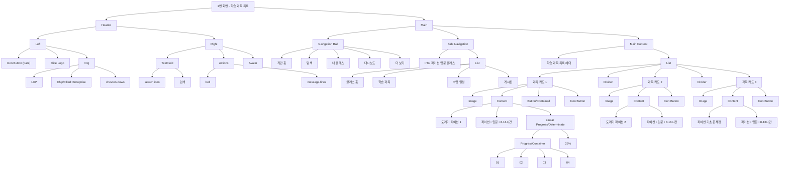

# UI Audit 분석
---

## 1. UI 요소 목록 정리

| 구분 | UI 요소 | 실제 표기 / data-name | 비고 |
|---|---|---|---|
| Screen | 전체 화면 | `1번 화면 - 학습 과목 목록` | 전체 페이지 컨테이너 |
| Header | 상단 헤더 | `Header` | sticky 헤더 |
| Header | 햄버거 아이콘 버튼 | `Icon Button` | 아이콘: `bars` |
| Brand | 로고 | `Elice Logo` | 엘리스 로고 |
| Selector | 조직 선택 버튼 | `Org` | `LXP`, `Enterprise`, chevron-down 포함 |
| Input | 검색 필드 | `TextField` | 내부 텍스트 `검색` |
| Action | 알림 아이콘 버튼 | `Icon Button` | 아이콘: `bell` |
| Action | 메시지 아이콘 버튼 | `Children` 내부 버튼 | 아이콘: `message-lines` |
| Avatar | 프로필 원형 영역 | 원형 도형 | 32x32 회색 원 |
| Navigation | 네비게이션 레일 | `Navigation Rail` | 아이콘 + 라벨 구조 |
| Navigation Item | 기관 홈 | `ListItem` | 아이콘: `home` |
| Navigation Item | 탐색 | `ListItem` | 아이콘: `compass` |
| Navigation Item | 내 클래스 | `ListItem` | 아이콘: `book-open-cover` |
| Navigation Item | 대시보드 | `ListItem` | 아이콘: `table-columns` |
| Navigation Item | 더 보기 | `ListItem` | 아이콘: `ellipsis` |
| Navigation | 사이드 네비게이션 | `Side Navigation` | 클래스 단위 메뉴 |
| Info | 클래스 정보 영역 | `Info` | 텍스트: `파이썬 입문 클래스` |
| Side Nav Item | 클래스 홈 | `ListItem` | 아이콘: `chalkboard-user` |
| Side Nav Item | 학습 과목 | `ListItem` | 아이콘: `list` |
| Side Nav Item | 수업 일정 | `ListItem` | 아이콘: `calendar` |
| Side Nav Item | 게시판 | `ListItem` | 아이콘: `chalkboard` |
| Section Header | 페이지 제목 | `학습 과목 목록 헤더` | 텍스트: `학습 과목 목록` |
| Card | 과목 카드 | `과목 카드` | 과목 썸네일 + 텍스트 + 액션 |
| Media | 썸네일 영역 | `Image` | 160x90 placeholder |
| Text | 과목명 텍스트 | `Text` | `도레미 파이썬 1/2`, `파이썬 기초 문제집` |
| Text | 메타 정보 텍스트 | `Text` | `파이썬 • 입문 • 8-16시간` |
| Progress | 진도 바 | `Linear Progress/Determinate` | `25%` 표시 포함 |
| Progress Segment | 진도 세그먼트 | `01`, `02`, `03`, `04` | `01`만 채워짐 |
| Button | 이어서 학습하기 버튼 | `Button/Contained` | 텍스트: `이어서 학습하기` |
| Action | 더보기 아이콘 버튼 | `Icon Button` | 아이콘: `ellipsis-vertical` |
| Divider | 구분선 | `Divider` | 카드 간 separator |
| Layout | 메인 영역 | `Main` | Navigation Rail + Side Navigation + 본문 |
| Layout | 카드 목록 | `List` | 카드 리스트 구조 |
| Layout | 박스 컨테이너 | `Box` | 제목 + 리스트 래핑 |

---

## 2. 컴포넌트 단위 목록

| 영역 | 컴포넌트 | 실제 data-name | 구성 요소 |
|---|---|---|---|
| Header | Header | `Header` | Left + Right |
| Header | Header / Left | `Left` | 햄버거 버튼 + 로고 + 조직 선택 |
| Header | Header / 조직 선택 | `Org` | 텍스트 + Chip/Filled + chevron-down |
| Header | Header / Search | `TextField` | search icon + 입력 텍스트 |
| Header | Header / Actions | `Children` | 알림 버튼 + 메시지 버튼 |
| Header | Header / Avatar | 원형 도형 | 프로필 placeholder |
| Main | 페이지 루트 | `1번 화면 - 학습 과목 목록` | Header + Main |
| Main | Main Layout | `Main` | Navigation Rail + Side Navigation + Container |
| Navigation | Navigation Rail | `Navigation Rail` | 기관 홈 / 탐색 / 내 클래스 / 대시보드 / 더 보기 |
| Navigation | Rail Item | `ListItem` | Icon + Label |
| Navigation | Side Navigation | `Side Navigation` | Info + List |
| Navigation | Side Navigation / Info | `Info` | 클래스명 텍스트 |
| Navigation | Side Navigation / List | `List` | 클래스 홈 / 학습 과목 / 수업 일정 / 게시판 |
| Content | Content Wrapper | `Box` | 페이지 헤더 + 카드 목록 |
| Content | 페이지 헤더 | `학습 과목 목록 헤더` | 타이틀 텍스트 |
| Content | 과목 카드 | `과목 카드` | Image + Content + (Button) + Icon Button |
| Content | 과목 카드 / Image | `Image` | 썸네일 |
| Content | 과목 카드 / Text | `Text` | 과목명 + 메타 정보 |
| Content | 과목 카드 / Progress | `Linear Progress/Determinate` | ProgressContainer + Typography |
| Content | 과목 카드 / ProgressContainer | `ProgressContainer` | 단계 요소 (`01`, `02`, `03`, `04`) |
| Content | 과목 카드 / CTA | `Button/Contained` | 버튼 |
| Content | 과목 카드 / More | `Icon Button` | 더보기 버튼 |
| Content | Divider | `Divider` | 구분선 |

---

## 3. 컴포넌트 그룹핑 시각화 (Mermaid)

---

## 메모

- 이번 버전은 **원본 코드에서 확인된 요소만** 남겼습니다.
- 이전에 포함됐던 `Tooltip`, `Alert`, `Badge`, `Grid`, `Select`, `Checkbox` 같은 항목은 **삭제**했습니다.
- 현재 zip 파일 기준으로는 **1번 화면만 확인 가능**해서, 5개 화면 전체 UI Audit으로 확장하려면 나머지 화면 파일도 필요합니다.
