# UI Audit 분석 - 2번 화면 (학습 과목)

---

## 1. UI 요소 목록

| 구분 | UI 요소 | 요소 이름 | 비고 |
|------|---------|-----------|------|
| **Header** | Logo | Elice Logo | 브랜드 로고, 보라색(#6700E6) |
| Header | Chip | Enterprise | 기관 유형 표시 칩 |
| Header | Dropdown Button | LXP | 서비스 선택 드롭다운 |
| Header | Menu Icon | Icon Button (bars) | 햄버거 메뉴 아이콘 |
| Header | Search Field | TextField | 검색 입력 필드 (220px) |
| Header | Notification Icon | Icon Button (bell) | 알림 아이콘 버튼 |
| Header | Message Icon | Icon Button (message-lines) | 메시지 아이콘 버튼 |
| Header | Avatar | Circle Avatar | 사용자 프로필 아바타 (회색) |
| **Navigation Rail** | Nav Item | 기관 홈 | home 아이콘, 64px 너비 |
| Navigation Rail | Nav Item | 탐색 | compass 아이콘, 64px 너비 |
| Navigation Rail | Nav Item | 내 클래스 | book-open-cover 아이콘, 64px 너비 |
| Navigation Rail | Nav Item | 대시보드 | table-columns 아이콘, 64px 너비 |
| Navigation Rail | Nav Item | 더 보기 | ellipsis 아이콘, 64px 너비 |
| **Side Navigation** | Title | 파이썬 입문 클래스 | 클래스 제목 (ExtraBold, 20px) |
| Side Navigation | Menu Item | 클래스 홈 | chalkboard-user 아이콘 |
| Side Navigation | Menu Item | 학습 과목 | list 아이콘, 현재 활성화 상태 (회색 배경) |
| Side Navigation | Menu Item | 수업 일정 | calendar 아이콘 |
| Side Navigation | Menu Item | 게시판 | chalkboard 아이콘 |
| **Main Content - Header** | Back Button | 과목 목록 | arrow-left 아이콘 |
| Main Content - Header | Title | 도레미 파이썬 1 | 메인 타이틀 (ExtraBold, 32px) |
| Main Content - Header | Description | 과목 설명 | Python 기초 설명 (Medium, 16px) |
| Main Content - Header | Thumbnail | Image | 224x126 비율, 회색 배경 |
| **Tabs** | Tab | 수업 목록 | 현재 활성화 탭 (하단 보더) |
| Tabs | Tab | 학습 현황 | 비활성화 탭 |
| Tabs | Tab | 학습맵 | 비활성화 탭 |
| Tabs | Tab | 과목 소개 | 비활성화 탭 |
| **Content Area** | CTA Card | 이어서 학습하기 | 회색 배경 카드, 테두리 있음 |
| Content Area | Subtitle | 기초 자료형: Python으로의 초대 | Medium, 14px |
| Content Area | Title | [실습1] 삼행시 짓기 : print() | ExtraBold, 20px |
| Content Area | Button | 이어서 학습하기 | 검정색 배경 버튼 |
| Content Area | Info Text | 학습 목차 정보 | 수업 6개 • 수업자료 80개 |
| Content Area | Button | 모두 펼치기 | Text 버튼 |
| **Accordion Items** | Accordion | 01 강의소개 | book-open-cover 아이콘, 진행률 표시 |
| Accordion Items | Progress Badge | 0% | 원형 진행률 표시 |
| Accordion Items | Expand Icon | chevron-down | 펼침/접힘 아이콘 |
| Accordion Items | Material Item | 학습 목차 수업 자료 | 다양한 자료 타입 아이콘 |
| Accordion Items | Material Icon | material-type-live-link | 라이브 링크 타입 |
| Accordion Items | Material Icon | material-type-exercise | 실습 타입 |
| Accordion Items | Material Icon | Icon/Dodo | 엘리스 캐릭터 아이콘 |
| Accordion Items | Button | 시작하기 / 다시 듣기 | Outlined 버튼 |
| Accordion Items | Accordion | 02 print 함수의 활용 | 0% 진행률 |
| Accordion Items | Accordion | 03 숫자형 (Number) | 0% 진행률 |
| Accordion Items | Accordion | 04 불린 (Bool) | 0% 진행률 |
| Accordion Items | Accordion | 05 문자열 (String) | 0% 진행률 |
| Accordion Items | Accordion | 06 최종 점검 | 시험 아이콘, 공개 예정 |

---

## 2. 컴포넌트 단위 목록

| 영역 | 컴포넌트 | 실제 data-name | 구성 요소 |
|------|----------|----------------|-----------|
| **Screen** | 메인 레이아웃 | 2번 화면 - 학습 과목 | Header + NavigationRail + SideNavigation + Main |
| **Header** | Header | Header | Left + Right |
| Header | Left | Left | IconButton + Org |
| Header | Org | Org | EliceLogo + ButtonText |
| Header | EliceLogo | Elice Logo | SVG 로고 |
| Header | ButtonText | Button/Text | Stack (LXP + Chip) + Icon (chevron-down) |
| Header | ChipFilled | Chip/Filled | Typography (Enterprise) |
| Header | Right | Right | TextField + Children + Avatar |
| Header | TextField | TextField | Input > Content > AdornStart + 검색 텍스트 |
| Header | Children | Children | IconButton (bell) + Container (message-lines) |
| **Navigation Rail** | NavigationRail | Navigation Rail | Content > List + List |
| Navigation Rail | List (상단) | List | ListItem (기관 홈) |
| Navigation Rail | List (하단) | List | ListItem (탐색, 내 클래스, 대시보드, 더 보기) |
| Navigation Rail | ListItem | ListItem | Container > Icon + 텍스트 |
| **Side Navigation** | SideNavigation | Side Navigation | Content > Info + Stack |
| Side Navigation | Info | Info | 클래스 제목 |
| Side Navigation | Stack | Stack | List (메뉴 아이템들) |
| Side Navigation | List | List | ListItem × 4 |
| Side Navigation | ListItem | ListItem | Container > Left + Text |
| **Main** | Main | Main | Container > Box |
| Main | Box | Box | Component (과목 헤더) + Component1 (이어서 학습하기) + Component3 (학습 목차 정보) + AccordionGroup |
| **과목 헤더** | Component | 과목 헤더 | Inner + Tabs |
| 과목 헤더 | Inner | Inner | Left (버튼 + 제목 + 설명) + Image |
| 과목 헤더 | Tabs | Tabs | Tab (Frame) + DividerHorizontal |
| 과목 헤더 | Frame | - | Tab1 + Tab2 + Tab3 + Tab4 |
| **이어서 학습하기** | Component1 | 이어서 학습하기 | Summary |
| 이어서 학습하기 | Summary | Summary | Left (Stack + 제목) + ButtonContained |
| **학습 목차 정보** | Component3 | 학습 목차 정보 | 정보 텍스트 + ButtonText (모두 펼치기) |
| **Accordion** | AccordionGroup | Accordion Group | Component4 + Component5 + Component14~17 |
| Accordion | Component4 | 학습 목차 1뎁스 | Summary > Left (Stack + 제목) + ProgressCircular + Icon |
| Accordion | Detail | Detail | List (학습 자료 목록) |
| Accordion | List | List | Component6~13 (수업 자료) |
| **학습 자료** | Component6 | 학습 목차 수업 자료 | Icon (Dodo) + 자료 제목 + MaterialType 아이콘 |
| 학습 자료 | MaterialTypeLiveLink | material-type-live-link | SVG 아이콘 (라이브 링크) |
| 학습 자료 | MaterialTypeExercise | material-type-exercise | SVG 아이콘 (실습) |
| 학습 자료 | IconDodo | Icon/Dodo | MaterialTypeLiveLink (엘리스 캐릭터) |
| **진행률** | ProgressCircular | Progress/Circular | 원형 진행바 + Typography (퍼센트) |
| **2뎁스 요약** | Summary1 | Summary | Left + ProgressCircular + Icon + ButtonOutlined |
| 2뎁스 요약 | ButtonOutlined | Button/Outlined | Base (시작하기/다시 듣기 텍스트) |
| **테스트 항목** | Component17 | 학습 목차 테스트 | Summary > Left (Stack + Metadate) + Icon |
| 테스트 항목 | Metadate | Metadate | 시험 텍스트 + 공개 예정 텍스트 |

---

## 3. 컴포넌트 구조 시각화

```mermaid
graph TD
    Root["2번 화면 - 학습 과목"]

    %% Header 그룹
    Header["Header"]:::headerStyle
    HeaderLeft["Left"]:::headerStyle
    IconButton["IconButton bars"]:::headerStyle
    Org["Org"]:::headerStyle
    EliceLogo["EliceLogo"]:::headerStyle
    ButtonText["ButtonText LXP + Enterprise Chip"]:::headerStyle

    HeaderRight["Right"]:::headerStyle
    TextField["TextField 검색"]:::headerStyle
    Children["Children"]:::headerStyle
    Bell["IconButton bell"]:::headerStyle
    Message["Container message-lines"]:::headerStyle
    Avatar["Avatar"]:::headerStyle

    %% Navigation Rail 그룹
    NavRail["NavigationRail"]:::navRailStyle
    NavContent["Content"]:::navRailStyle
    NavList1["List 기관 홈"]:::navRailStyle
    NavList2["List 탐색 / 내 클래스 / 대시보드 / 더 보기"]:::navRailStyle

    %% Side Navigation 그룹
    SideNav["SideNavigation"]:::sideNavStyle
    SideContent["Content"]:::sideNavStyle
    Info["Info 파이썬 입문 클래스"]:::sideNavStyle
    Stack1["Stack"]:::sideNavStyle
    List2["List"]:::sideNavStyle
    ListItem5["클래스 홈"]:::sideNavStyle
    ListItem6["학습 과목 ★ 활성"]:::sideNavStyle
    ListItem7["수업 일정"]:::sideNavStyle
    ListItem8["게시판"]:::sideNavStyle

    %% Main 영역
    Main["Main"]:::mainStyle
    Container13["Container"]:::mainStyle
    Box["Box"]:::mainStyle

    %% 과목 헤더
    SubjectHeader["과목 헤더 Component"]:::contentStyle
    Inner["Inner"]:::contentStyle
    Left5["Left 과목 목록 버튼 / 제목 / 설명"]:::contentStyle
    ImageThumb["Image 썸네일"]:::contentStyle
    Tabs["Tabs"]:::contentStyle
    Frame["Frame 4개 탭"]:::contentStyle
    Tab1["수업 목록 ★ 활성"]:::contentStyle
    Tab2["학습 현황"]:::contentStyle
    Tab3["학습맵"]:::contentStyle
    Tab4["과목 소개"]:::contentStyle

    %% 이어서 학습하기
    ContinueLearning["이어서 학습하기 Component1"]:::ctaStyle
    Summary["Summary"]:::ctaStyle
    Left6["Left 실습 정보"]:::ctaStyle
    ButtonContained["ButtonContained 이어서 학습하기"]:::ctaStyle

    %% 학습 목차 정보
    LessonInfo["학습 목차 정보 Component3"]:::infoStyle
    InfoText["수업 6개 / 수업자료 80개"]:::infoStyle
    ButtonText2["모두 펼치기"]:::infoStyle

    %% Accordion 그룹
    AccordionGroup["AccordionGroup"]:::accordionStyle

    Accordion1["01 강의소개 Component4"]:::accordionStyle
    Summary1["Summary 0% 진행률"]:::accordionStyle
    Detail1["Detail 펼쳐진 상태"]:::accordionStyle
    List3["List 학습 자료 8개"]:::accordionStyle
    Material1["수업 자료 1 live-link"]:::materialStyle
    Material2["수업 자료 2 live-link"]:::materialStyle
    Material3["수업 자료 3 exercise"]:::materialStyle
    Material4["수업 자료 4 exercise"]:::materialStyle
    Material5["수업 자료 5 live-link"]:::materialStyle
    Material6["수업 자료 6 exercise"]:::materialStyle
    Material7["수업 자료 7 exercise"]:::materialStyle
    Material8["수업 자료 8 exercise"]:::materialStyle

    Accordion2["02 print 함수의 활용 Component5"]:::accordionStyle
    Summary2["Summary 0% 진행률"]:::accordionStyle

    Accordion3["03 숫자형 Component14"]:::accordionStyle
    Summary3["Summary 0% 진행률"]:::accordionStyle

    Accordion4["04 불린 Component15"]:::accordionStyle
    Summary4["Summary 0% 진행률"]:::accordionStyle

    Accordion5["05 문자열 Component16"]:::accordionStyle
    Summary5["Summary 0% 진행률"]:::accordionStyle

    Accordion6["06 최종 점검 Component17"]:::accordionStyle
    Summary6["Summary 공개 예정"]:::accordionStyle

    %% 구조 연결
    Root --> Header
    Root --> NavRail
    Root --> SideNav
    Root --> Main

    Header --> HeaderLeft
    Header --> HeaderRight
    HeaderLeft --> IconButton
    HeaderLeft --> Org
    Org --> EliceLogo
    Org --> ButtonText
    HeaderRight --> TextField
    HeaderRight --> Children
    HeaderRight --> Avatar
    Children --> Bell
    Children --> Message

    NavRail --> NavContent
    NavContent --> NavList1
    NavContent --> NavList2

    SideNav --> SideContent
    SideContent --> Info
    SideContent --> Stack1
    Stack1 --> List2
    List2 --> ListItem5
    List2 --> ListItem6
    List2 --> ListItem7
    List2 --> ListItem8

    Main --> Container13
    Container13 --> Box

    Box --> SubjectHeader
    Box --> ContinueLearning
    Box --> LessonInfo
    Box --> AccordionGroup

    SubjectHeader --> Inner
    SubjectHeader --> Tabs
    Inner --> Left5
    Inner --> ImageThumb
    Tabs --> Frame
    Frame --> Tab1
    Frame --> Tab2
    Frame --> Tab3
    Frame --> Tab4

    ContinueLearning --> Summary
    Summary --> Left6
    Summary --> ButtonContained

    LessonInfo --> InfoText
    LessonInfo --> ButtonText2

    AccordionGroup --> Accordion1
    AccordionGroup --> Accordion2
    AccordionGroup --> Accordion3
    AccordionGroup --> Accordion4
    AccordionGroup --> Accordion5
    AccordionGroup --> Accordion6

    Accordion1 --> Summary1
    Accordion1 --> Detail1
    Detail1 --> List3
    List3 --> Material1
    List3 --> Material2
    List3 --> Material3
    List3 --> Material4
    List3 --> Material5
    List3 --> Material6
    List3 --> Material7
    List3 --> Material8

    Accordion2 --> Summary2
    Accordion3 --> Summary3
    Accordion4 --> Summary4
    Accordion5 --> Summary5
    Accordion6 --> Summary6

    classDef headerStyle fill:#E8D5F2,stroke:#6700E6,stroke-width:2px,color:#000
    classDef navRailStyle fill:#FFE5CC,stroke:#FF9933,stroke-width:2px,color:#000
    classDef sideNavStyle fill:#CCE5FF,stroke:#3366FF,stroke-width:2px,color:#000
    classDef mainStyle fill:#F0F0F0,stroke:#666,stroke-width:2px,color:#000
    classDef contentStyle fill:#D4EDDA,stroke:#28A745,stroke-width:2px,color:#000
    classDef ctaStyle fill:#FFF3CD,stroke:#FFC107,stroke-width:2px,color:#000
    classDef infoStyle fill:#D1ECF1,stroke:#17A2B8,stroke-width:2px,color:#000
    classDef accordionStyle fill:#E2E3E5,stroke:#6C757D,stroke-width:2px,color:#000
    classDef materialStyle fill:#F8D7DA,stroke:#DC3545,stroke-width:1px,color:#000
```

---
진 상태 |
| 학습 자료 타입 | live-link, exercise 등 다양한 자료 타입 지원 |
