# UI Audit 분석 - 2번 화면 (수업목록)

## 1. UI 요소 목록

| 구분 | UI 요소 | 요소 이름 | 비고 |
|------|---------|-----------|------|
| **Header** | Logo | `Elice Logo` | 브랜드 로고, 보라색(#6700E6) |
| Header | Chip | `Enterprise` | 기관 유형 표시 칩 |
| Header | Dropdown Button | `LXP` | 서비스 선택 드롭다운 |
| Header | Menu Icon | `Icon Button (bars)` | 햄버거 메뉴 아이콘 |
| Header | Search Field | `TextField` | 검색 입력 필드 (220px) |
| Header | Notification Icon | `Icon Button (bell)` | 알림 아이콘 버튼 |
| Header | Message Icon | `Icon Button (message-lines)` | 메시지 아이콘 버튼 |
| Header | Avatar | `Circle Avatar` | 사용자 프로필 아바타 (회색) |
| **Navigation Rail** | Nav Item | `기관 홈` | home 아이콘, 64px 너비 |
| Navigation Rail | Nav Item | `탐색` | compass 아이콘, 64px 너비 |
| Navigation Rail | Nav Item | `내 클래스` | book-open-cover 아이콘, 64px 너비 |
| Navigation Rail | Nav Item | `대시보드` | table-columns 아이콘, 64px 너비 |
| Navigation Rail | Nav Item | `더 보기` | ellipsis 아이콘, 64px 너비 |
| **Side Navigation** | Title | `파이썬 입문 클래스` | 클래스 제목 (ExtraBold, 20px) |
| Side Navigation | Menu Item | `클래스 홈` | chalkboard-user 아이콘 |
| Side Navigation | Menu Item | `학습 과목` | list 아이콘 |
| Side Navigation | Menu Item | `수업 일정` | calendar 아이콘 |
| Side Navigation | Menu Item | `게시판` | chalkboard 아이콘 |
| **Main Content - Header** | Back Button | `과목 목록` | arrow-left 아이콘 |
| Main Content - Header | Title | `도레미 파이썬 1` | 메인 타이틀 (ExtraBold, 32px) |
| Main Content - Header | Description | `과목 설명` | Python 기초 설명 (Medium, 16px) |
| Main Content - Header | Thumbnail | `Image` | 224x126 비율, 회색 배경 |
| **Tabs** | Tab | `수업 목록` | 비활성화 탭 |
| Tabs | Tab | `학습 현황` | 현재 활성화 탭 (하단 보더) |
| Tabs | Tab | `학습맵` | 비활성화 탭 |
| Tabs | Tab | `과목 소개` | 비활성화 탭 |
| **학습 현황 요약** | Summary Card | `Container` | 회색 배경 카드 영역 |
| 학습 현황 요약 | Info Item | `전체 수업` | 아이콘 + 숫자 (6개) |
| 학습 현황 요약 | Info Item | `학습 시간` | 아이콘 + 시간 (0시간 0분) |
| 학습 현황 요약 | Info Item | `학습 진도율` | 아이콘 + 퍼센트 (0%) |
| **학습 현황 그래프** | Chart Container | `학습 현황 그래프` | 868×320px 영역 |
| 학습 현황 그래프 | Left Panel | `통계 정보` | 4개 통계 카드 |
| 학습 현황 그래프 | Stat Card | `전체 학습자` | 숫자 + 라벨 (56명) |
| 학습 현황 그래프 | Stat Card | `미시작` | 숫자 + 라벨 (56명) |
| 학습 현황 그래프 | Stat Card | `학습중` | 숫자 + 라벨 (0명) |
| 학습 현황 그래프 | Stat Card | `완료` | 숫자 + 라벨 (0명) |
| 학습 현황 그래프 | Right Panel | `Bar Chart` | 막대 그래프 |
| 학습 현황 그래프 | Chart Title | `수업별 학습 현황` | ExtraBold, 20px |
| 학습 현황 그래프 | Bar | `01 강의소개` | 회색 막대 (0/56) |
| 학습 현황 그래프 | Bar | `02 print 함수의 활용` | 회색 막대 (0/56) |
| 학습 현황 그래프 | Bar | `03 숫자형 (Number)` | 회색 막대 (0/56) |
| 학습 현황 그래프 | Bar | `04 불린 (Bool)` | 회색 막대 (0/56) |
| 학습 현황 그래프 | Bar | `05 문자열 (String)` | 회색 막대 (0/56) |
| 학습 현황 그래프 | Bar | `06 최종 점검` | 회색 막대 (0/56) |
| **수업별 학습 현황** | Section Title | `수업별 학습 현황` | ExtraBold, 20px |
| 수업별 학습 현황 | Export Button | `csv 다운로드` | Outlined 버튼 |
| 수업별 학습 현황 | Table | `Data Table` | 전체 너비 테이블 |
| 수업별 학습 현황 | Table Header | `이름` | 정렬 가능한 헤더 |
| 수업별 학습 현황 | Table Header | `이메일` | 정렬 가능한 헤더 |
| 수업별 학습 현황 | Table Header | `학습시간` | 정렬 가능한 헤더 |
| 수업별 학습 현황 | Table Header | `진도율` | 정렬 가능한 헤더 |
| 수업별 학습 현황 | Table Header | `01 강의소개` | 정렬 가능한 헤더 |
| 수업별 학습 현황 | Table Header | `02 print 함수의 활용` | 정렬 가능한 헤더 |
| 수업별 학습 현황 | Table Header | `03 숫자형 (Number)` | 정렬 가능한 헤더 |
| 수업별 학습 현황 | Table Header | `04 불린 (Bool)` | 정렬 가능한 헤더 |
| 수업별 학습 현황 | Table Header | `05 문자열 (String)` | 정렬 가능한 헤더 |
| 수업별 학습 현황 | Table Header | `06 최종 점검` | 정렬 가능한 헤더 |
| 수업별 학습 현황 | Table Row | `학습자 정보` | 25개 행 (25명 학습자) |
| 수업별 학습 현황 | Cell | `Name` | 학습자 이름 |
| 수업별 학습 현황 | Cell | `Email` | 학습자 이메일 |
| 수업별 학습 현황 | Cell | `Time` | 학습 시간 (0시간 0분) |
| 수업별 학습 현황 | Cell | `Progress` | 진도율 (0%) |
| 수업별 학습 현황 | Cell | `Lesson Status` | 수업별 완료 상태 (미시작/완료) |
| 수업별 학습 현황 | Status Badge | `미시작` | 회색 배경 뱃지 |
| 수업별 학습 현황 | Status Badge | `완료` | 초록색 배경 뱃지 |
| 수업별 학습 현황 | Pagination | `Page Navigation` | 페이지 네비게이션 (1-3 페이지) |
| 수업별 학습 현황 | Pagination Button | `이전` | arrow-left 아이콘 |
| 수업별 학습 현황 | Pagination Button | `다음` | arrow-right 아이콘 |
| 수업별 학습 현황 | Pagination Number | `1 / 2 / 3` | 페이지 번호 버튼 |

---

## 2. 컴포넌트 단위 목록

| 영역 | 컴포넌트 | 실제 data-name | 구성 요소 |
|------|----------|----------------|-----------|
| **Screen** | 메인 레이아웃 | `3번 화면 - 학습 현황` | Header + NavigationRail + SideNavigation + Main |
| **Header** | Header | `Header` | Left + Right |
| Header | Left | `Left` | IconButton + Org |
| Header | Org | `Org` | EliceLogo + ButtonText |
| Header | EliceLogo | `Elice Logo` | SVG 로고 |
| Header | ButtonText | `Button/Text` | Stack (LXP + Chip) + Icon (chevron-down) |
| Header | ChipFilled | `Chip/Filled` | Typography (Enterprise) |
| Header | Right | `Right` | TextField + Children + Avatar |
| Header | TextField | `TextField` | Input > Content > AdornStart + 검색 텍스트 |
| Header | Children | `Children` | IconButton (bell) + Container (message-lines) |
| **Navigation Rail** | NavigationRail | `Navigation Rail` | Content > List + List |
| Navigation Rail | List (상단) | `List` | ListItem (기관 홈) |
| Navigation Rail | List (하단) | `List` | ListItem (탐색, 내 클래스, 대시보드, 더 보기) |
| Navigation Rail | ListItem | `ListItem` | Container > Icon + 텍스트 |
| **Side Navigation** | SideNavigation | `Side Navigation` | Content > Info + Stack |
| Side Navigation | Info | `Info` | 클래스 제목 |
| Side Navigation | Stack | `Stack` | List (메뉴 아이템들) |
| Side Navigation | List | `List` | ListItem × 4 |
| Side Navigation | ListItem | `ListItem` | Container > Left + Text |
| **Main** | Main | `Main` | Container > Box |
| Main | Box | `Box` | Component (과목 헤더) + Component1 (학습 현황 요약) + Component2 (학습 현황 그래프) + Component3 (수업별 학습 현황) |
| **과목 헤더** | Component | `과목 헤더` | Inner + Tabs |
| 과목 헤더 | Inner | `Inner` | Left (버튼 + 제목 + 설명) + Image |
| 과목 헤더 | Tabs | `Tabs` | Tab (Frame) + DividerHorizontal |
| 과목 헤더 | Frame | `-` | Tab1 + Tab2 + Tab3 + Tab4 |
| **학습 현황 요약** | Component1 | `학습 현황 요약` | Container > Component × 3 |
| 학습 현황 요약 | Component | `전체 수업` | Icon (book-open-cover) + Stack (숫자 + 라벨) |
| 학습 현황 요약 | Component | `학습 시간` | Icon (stopwatch) + Stack (시간 + 라벨) |
| 학습 현황 요약 | Component | `학습 진도율` | Icon (chart-simple) + Stack (퍼센트 + 라벨) |
| **학습 현황 그래프** | Component2 | `학습 현황 그래프` | Left (통계 카드) + Right (막대 그래프) |
| 학습 현황 그래프 | Left | `Container` | Stack × 4 (통계 카드) |
| 학습 현황 그래프 | Stack | `통계 카드` | Typography (숫자) + Typography (라벨) |
| 학습 현황 그래프 | Right | `Container` | Component (제목) + Frame (차트) |
| 학습 현황 그래프 | Frame | `Chart Frame` | Grid (Y축) + Container (막대 그룹) + Grid (X축) |
| 학습 현황 그래프 | Container (막대) | `Bar Group` | Component × 6 (수업별 막대) |
| 학습 현황 그래프 | Component (막대) | `Bar Item` | Container (막대) + Typography (수업명) |
| 학습 현황 그래프 | Container (막대바) | `Bar Container` | Frame (회색 배경) + Frame (진행 막대) |
| **수업별 학습 현황** | Component3 | `수업별 학습 현황` | Container > Component (제목) + Component1 (테이블) + Component2 (페이지네이션) |
| 수업별 학습 현황 | Component (제목) | `Section Header` | Typography + ButtonOutlined (csv 다운로드) |
| 수업별 학습 현황 | Component1 | `Table Container` | Inner (테이블) |
| 수업별 학습 현황 | Inner | `Table` | Header + Body |
| 수업별 학습 현황 | Header | `Table Header` | Row (헤더 행) |
| 수업별 학습 현황 | Row (헤더) | `Header Row` | Cell × 10 (헤더 셀) |
| 수업별 학습 현황 | Cell (헤더) | `Header Cell` | Typography + Icon (arrows-up-down) |
| 수업별 학습 현황 | Body | `Table Body` | Row × 25 (데이터 행) |
| 수업별 학습 현황 | Row (데이터) | `Data Row` | Cell × 10 (데이터 셀) |
| 수업별 학습 현황 | Cell (이름) | `Name Cell` | Typography (이름) |
| 수업별 학습 현황 | Cell (이메일) | `Email Cell` | Typography (이메일) |
| 수업별 학습 현황 | Cell (시간) | `Time Cell` | Typography (시간) |
| 수업별 학습 현황 | Cell (진도율) | `Progress Cell` | Typography (퍼센트) |
| 수업별 학습 현황 | Cell (수업) | `Lesson Cell` | Chip (미시작/완료) |
| 수업별 학습 현황 | Chip | `Status Chip` | Typography (상태) |
| 수업별 학습 현황 | Component2 | `Pagination` | Container > ButtonIcon (이전) + Frame (페이지 번호) + ButtonIcon (다음) |
| 수업별 학습 현황 | Frame | `Page Numbers` | ButtonText × 3 (1, 2, 3) |

---

## 3. 컴포넌트 구조 시각화

```mermaid
graph TD
    Root["3번 화면 - 학습 현황"]

    %% Header 그룹
    Header["Header"]:::headerStyle
    HeaderLeft["Left"]:::headerStyle
    IconButton["IconButton bars"]:::headerStyle
    Org["Org"]:::headerStyle
    EliceLogo["EliceLogo"]:::headerStyle
    ButtonText["ButtonText LXP + Enterprise Chip"]:::headerStyle

    HeaderRight["Right"]:::headerStyle
    TextField["TextField 검색"]:::headerStyle
    Children["Children"]:::headerStyle
    Bell["IconButton bell"]:::headerStyle
    Message["Container message-lines"]:::headerStyle
    Avatar["Avatar"]:::headerStyle

    %% Navigation Rail 그룹
    NavRail["NavigationRail"]:::navRailStyle
    NavContent["Content"]:::navRailStyle
    NavList1["List 기관 홈"]:::navRailStyle
    NavList2["List 탐색 / 내 클래스 / 대시보드 / 더 보기"]:::navRailStyle

    %% Side Navigation 그룹
    SideNav["SideNavigation"]:::sideNavStyle
    SideContent["Content"]:::sideNavStyle
    Info["Info 파이썬 입문 클래스"]:::sideNavStyle
    Stack1["Stack"]:::sideNavStyle
    List2["List"]:::sideNavStyle
    ListItem5["클래스 홈"]:::sideNavStyle
    ListItem6["학습 과목"]:::sideNavStyle
    ListItem7["수업 일정"]:::sideNavStyle
    ListItem8["게시판"]:::sideNavStyle

    %% Main 영역
    Main["Main"]:::mainStyle
    Container13["Container"]:::mainStyle
    Box["Box"]:::mainStyle

    %% 과목 헤더
    SubjectHeader["과목 헤더 Component"]:::contentStyle
    Inner["Inner"]:::contentStyle
    Left5["Left 과목 목록 버튼 / 제목 / 설명"]:::contentStyle
    ImageThumb["Image 썸네일"]:::contentStyle
    Tabs["Tabs"]:::contentStyle
    Frame["Frame 4개 탭"]:::contentStyle
    Tab1["수업 목록"]:::contentStyle
    Tab2["학습 현황 ★ 활성"]:::contentStyle
    Tab3["학습맵"]:::contentStyle
    Tab4["과목 소개"]:::contentStyle

    %% 학습 현황 요약
    Summary["학습 현황 요약 Component1"]:::summaryStyle
    SummaryContainer["Container"]:::summaryStyle
    SummaryItem1["전체 수업 6개"]:::summaryStyle
    SummaryItem2["학습 시간 0시간 0분"]:::summaryStyle
    SummaryItem3["학습 진도율 0%"]:::summaryStyle

    %% 학습 현황 그래프
    GraphSection["학습 현황 그래프 Component2"]:::graphStyle
    GraphLeft["Left 통계 카드"]:::graphStyle
    Stat1["전체 학습자 56명"]:::graphStyle
    Stat2["미시작 56명"]:::graphStyle
    Stat3["학습중 0명"]:::graphStyle
    Stat4["완료 0명"]:::graphStyle
    GraphRight["Right 막대 그래프"]:::graphStyle
    ChartTitle["수업별 학습 현황"]:::graphStyle
    ChartFrame["Chart Frame"]:::graphStyle
    BarGroup["Bar Group 6개 수업"]:::graphStyle
    Bar1["01 강의소개"]:::graphStyle
    Bar2["02 print 함수"]:::graphStyle
    Bar3["03 숫자형"]:::graphStyle
    Bar4["04 불린"]:::graphStyle
    Bar5["05 문자열"]:::graphStyle
    Bar6["06 최종 점검"]:::graphStyle

    %% 수업별 학습 현황 테이블
    TableSection["수업별 학습 현황 Component3"]:::tableStyle
    TableHeader["Section Header"]:::tableStyle
    TableTitle["수업별 학습 현황"]:::tableStyle
    ExportBtn["csv 다운로드"]:::tableStyle
    TableContainer["Table Container Component1"]:::tableStyle
    TableInner["Inner Table"]:::tableStyle
    THeader["Table Header"]:::tableStyle
    THeaderRow["Header Row"]:::tableStyle
    THeaderCells["10개 헤더 셀"]:::tableStyle
    TBody["Table Body"]:::tableStyle
    TDataRows["25개 데이터 행"]:::tableStyle
    Pagination["Pagination Component2"]:::tableStyle
    PrevBtn["이전 버튼"]:::tableStyle
    PageNumbers["1 / 2 / 3"]:::tableStyle
    NextBtn["다음 버튼"]:::tableStyle

    %% 구조 연결
    Root --> Header
    Root --> NavRail
    Root --> SideNav
    Root --> Main

    Header --> HeaderLeft
    Header --> HeaderRight
    HeaderLeft --> IconButton
    HeaderLeft --> Org
    Org --> EliceLogo
    Org --> ButtonText
    HeaderRight --> TextField
    HeaderRight --> Children
    HeaderRight --> Avatar
    Children --> Bell
    Children --> Message

    NavRail --> NavContent
    NavContent --> NavList1
    NavContent --> NavList2

    SideNav --> SideContent
    SideContent --> Info
    SideContent --> Stack1
    Stack1 --> List2
    List2 --> ListItem5
    List2 --> ListItem6
    List2 --> ListItem7
    List2 --> ListItem8

    Main --> Container13
    Container13 --> Box

    Box --> SubjectHeader
    Box --> Summary
    Box --> GraphSection
    Box --> TableSection

    SubjectHeader --> Inner
    SubjectHeader --> Tabs
    Inner --> Left5
    Inner --> ImageThumb
    Tabs --> Frame
    Frame --> Tab1
    Frame --> Tab2
    Frame --> Tab3
    Frame --> Tab4

    Summary --> SummaryContainer
    SummaryContainer --> SummaryItem1
    SummaryContainer --> SummaryItem2
    SummaryContainer --> SummaryItem3

    GraphSection --> GraphLeft
    GraphSection --> GraphRight
    GraphLeft --> Stat1
    GraphLeft --> Stat2
    GraphLeft --> Stat3
    GraphLeft --> Stat4
    GraphRight --> ChartTitle
    GraphRight --> ChartFrame
    ChartFrame --> BarGroup
    BarGroup --> Bar1
    BarGroup --> Bar2
    BarGroup --> Bar3
    BarGroup --> Bar4
    BarGroup --> Bar5
    BarGroup --> Bar6

    TableSection --> TableHeader
    TableSection --> TableContainer
    TableSection --> Pagination
    TableHeader --> TableTitle
    TableHeader --> ExportBtn
    TableContainer --> TableInner
    TableInner --> THeader
    TableInner --> TBody
    THeader --> THeaderRow
    THeaderRow --> THeaderCells
    TBody --> TDataRows
    Pagination --> PrevBtn
    Pagination --> PageNumbers
    Pagination --> NextBtn

    classDef headerStyle fill:#E8D5F2,stroke:#6700E6,stroke-width:2px,color:#000
    classDef navRailStyle fill:#FFE5CC,stroke:#FF9933,stroke-width:2px,color:#000
    classDef sideNavStyle fill:#CCE5FF,stroke:#3366FF,stroke-width:2px,color:#000
    classDef mainStyle fill:#F0F0F0,stroke:#666,stroke-width:2px,color:#000
    classDef contentStyle fill:#D4EDDA,stroke:#28A745,stroke-width:2px,color:#000
    classDef summaryStyle fill:#FFF3CD,stroke:#FFC107,stroke-width:2px,color:#000
    classDef graphStyle fill:#E7F3FF,stroke:#0066CC,stroke-width:2px,color:#000
    classDef tableStyle fill:#F8E8F5,stroke:#9933CC,stroke-width:2px,color:#000
```

---
